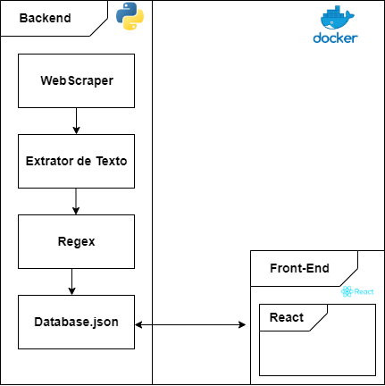

# **Arquitetura e Design do Sistema**

A arquitetura de software é o alicerce estrutural que define a organização, os componentes, as interações e os padrões de um sistema de software. Ela serve como um esqueleto lógico que molda o comportamento e a funcionalidade do sistema, proporcionando uma visão abrangente de como as partes se encaixam para atender aos requisitos do projeto. Através de decisões de design bem ponderadas, a arquitetura orienta o desenvolvimento, a escalabilidade, a manutenção e a evolução contínua do software. Este documento descreve detalhadamente a arquitetura deste sistema, oferecendo uma compreensão completa das escolhas de design, as interações entre os componentes e as diretrizes para o desenvolvimento e a manutenção bem-sucedidos do software.

## Visão Geral da Arquitetura 

A definição da arquitetura deste projeto foi moldada através de uma análise profunda do comportamento desejado para o software e uma avaliação detalhada dos requisitos que orientam sua concepção.  Abaixo, descrevemos os principais componentes da arquitetura:

### Backend

- **WebScraper**: 
Esta etapa é responsável por coletar dados da web. Utiliza Python para navegar e extrair informações de páginas web.

- **Extrator de Texto**: 
Após a coleta dos dados pelo WebScraper, este componente extrai texto relevante dos dados brutos.

- **Regex**:
 O texto extraído é processado utilizando expressões regulares para filtrar e formatar as informações desejadas.

- **Database.json**: 
Os dados processados são armazenados em um arquivo JSON, que serve como banco de dados para os próximos componentes do sistema.

### Front-End (React)
- **React Application**:
 O front-end é desenvolvido usando React mais vite, uma biblioteca JavaScript para construir interfaces de usuário. Ele se comunica com o banco de dados (Database.json) para obter os dados processados e exibi-los de forma interativa e dinâmica.

### Interação entre Back-End e Front-End
- 
A interação entre o banco de dados (Database.json) e o front-end desenvolvido em React permite que os dados processados sejam exibidos ao usuário final.

## Diagrama de Arquitetura

 Os diagramas de arquitetura fornecem uma visualização clara da estrutura e interação entre os componentes do sistema. (Nota: os diagramas devem ser criados e incorporados aqui utilizando ferramentas como Lucidchart, Draw.io, ou similares.) 

  

 

Esta arquitetura permite a coleta, processamento e exibição de dados de maneira eficiente e organizada. Isso porque após uma reunião com um dos membros do projeto que está se usando referência (Projeto [Exoonero](https://github.com/exoonero/extrator)), um dos tópicos mais questionados foi sobre o armazenamento dessa quantia de PDFs, .txt e dados de processamento do Regex. Foi mostrado que é possível realizar esse processo em tempo de execução de código para que não se tenha que armazenar para sempre esses dados, somente usar e apagar. Porém será necessário armazenar uma coisa: um arquivo .json que contém um "resumo" das informações, de onde será retirado os dados para montagem dos displays de dados no site.

## Diagrama Sequencial 

 O diagrama de sequência apresentado ilustra o fluxo de dados e as interações entre diferentes componentes do sistema. Este diagrama é essencial para entender como cada componente interage, garantindo que os dados sejam processados de forma eficiente e organizada. Utilizando tecnologias como Python para web scraping e processamento de texto, Docker para containerização, e React para o desenvolvimento da interface do usuário, o diagrama detalha cada etapa do processo, facilitando a compreensão do funcionamento geral do sistema. 

Caminho do Usuário, pagina Home:

 

Caminho do Usuário, pagina Sobre:

 

Caminho do Usuário, pagina Pesquisa Avançada:

Caminho do Software, camada de dados:

 

## Histórico de Versões

|    Data    | Versão |       Descrição       |      Autor      |
| :--------: | :----: | :-------------------: | :-------------: |
| 8/10/2023 |  0.1   | Abertura do documento | [Bruno Henrique Duarte](https://github.com/bdebatata) e   [Bianca Patrocinio](https://github.com/BiancaPatrocinio7)|
| 9/10/2023 |  0.2   | Acréscimo do detalhamento de cada camada | [Bruno Henrique Duarte](https://github.com/bdebatata) e   [Bianca Patrocinio](https://github.com/BiancaPatrocinio7)|
|09/10/2023|0.3| Arrumando para o build do mkdocs | [Bruno Henrique](https://github.com/bdebatata) |
|10/10/2023|0.4| Atualização da Documentação, Retirada da API do Google Drive | [Bruno Henrique](https://github.com/bdebatata) |
|10/10/2023| 0.5 |Modificações propostas pela equipe | [Bruno Henrique](https://github.com/bdebatata), [Larissa Vieira](https://github.com/VieiraLaris) e [Vitor Feijó](https://github.com/vitorfleonardo) |
|15/10/2023| 0.6 | Correção das imagens no build | [Bruno Henrique](https://github.com/bdebatata) e [Bianca Patrocinio](https://github.com/BiancaPatrocinio7)|
|24/10/2023|0.7|Correção da arquitetura | [Bruno Henrique](https://github.com/bdebatata) |

